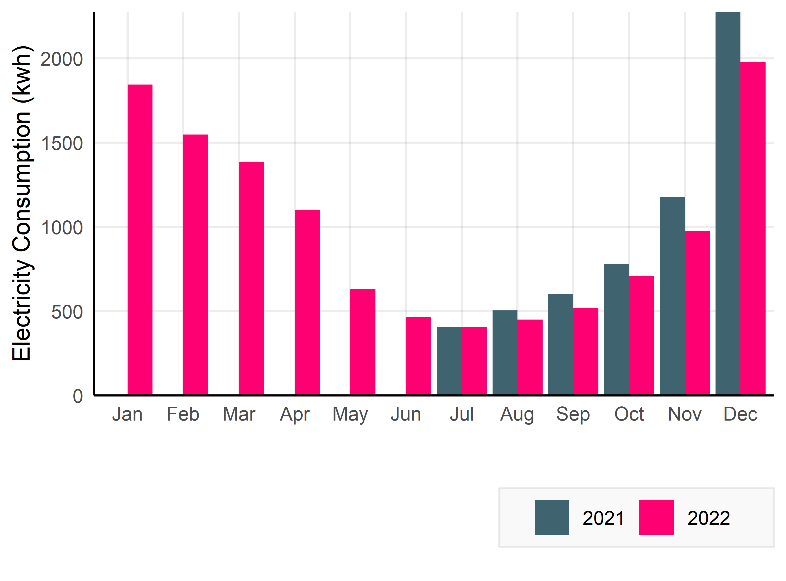
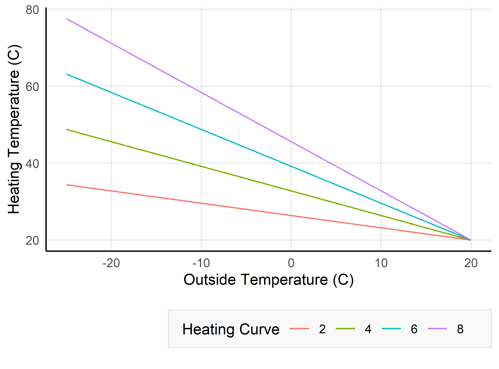
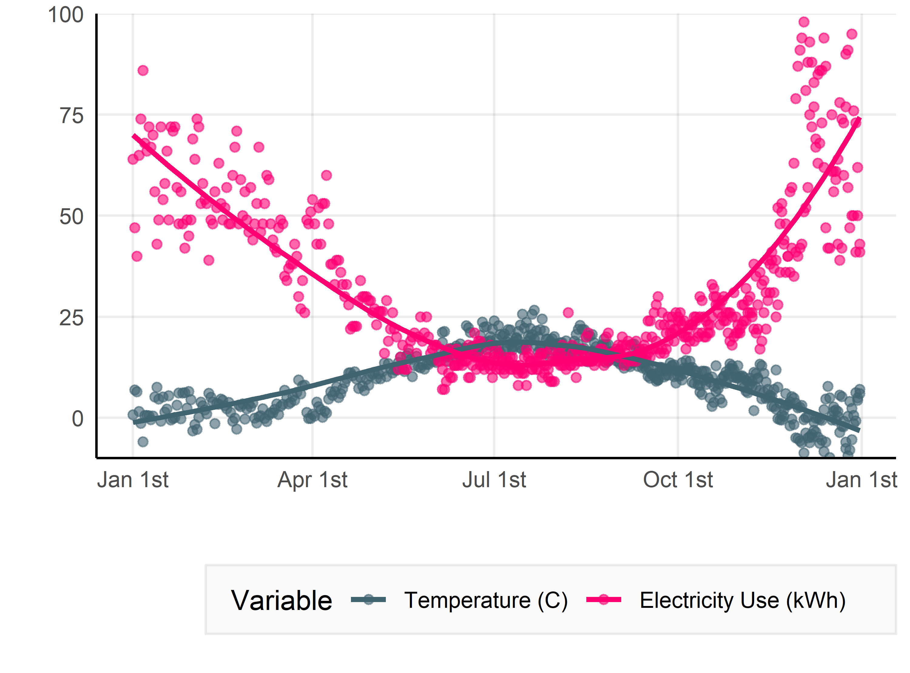
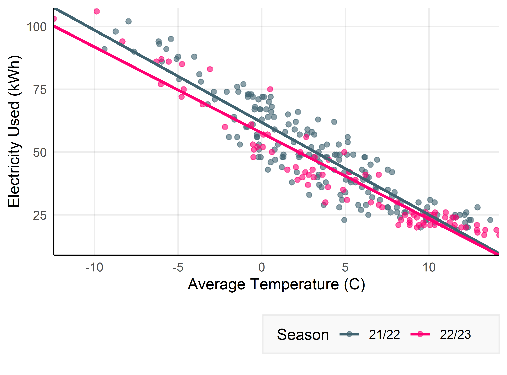

## Why is my electricity consumption down this winter?

Each month, my electricity bill is delivered with a plot like the one
below — it shows the amount of electricity consumed (in kilowatt-hours,
kwh) per month since we moved in. Since summer ended in 2022, we have
seen consistently lower consumption than we did the previous year.



#### Two likely causes

**Outside Temperature:** Our heating system is the single biggest
consumer of electricity in our home. It uses electricity to heat water
which is circulated radiators. The boiler determines warm that water
will be on the basis of the outside temperature — **heating the water
more, and using more energy, on colder days.**

**Heating Curve:** We can also set the strength of the heating, altering
how much it will heat the water in response to the outside temperature
by setting a parameter in the system called the “heating curve”.
Roughly, the water is heated to 0.16°C × *h* + 20, where *h* is the
heating curve value (between 0 and 10), for every degree below 20°C
outside. The figure below illustrates this for a few example values of
*h*. We have been gradually **lowering this curve value to reduce
electricity consumption** in recent months.



#### Focal Question:

> **Is our electricity consumption reducing because of warmer weather
> and/or lowered heating?**

The figure from our electricity provider does not allow us to know why
our electricity consumption is down. It may be down just because it has
been a warm winter.

#### Datasets

I need two pieces of data to answer my question. First I need data
showing our daily electricity consumption. This comes as from the
[Swedish electricity distributor,
Vattenfall](https://www.vattenfalleldistribution.se/). The other data I
need is climate data, showing daily temperature here in Vänersborg.
Climate data comes from the [Swedish meteorlogical and hydrological
institute,
SMHI](https://www.smhi.se/data/meteorologi/ladda-ner-meteorologiska-observationer#param=airtemperatureInstant,stations=core,stationid=82230).

``` r
plot_annual + 
  my_theme() + 
  scale_color_manual(name="Variable", 
                     labels=c('Temperature (C)', 'Electricity Use (kWh)'), 
                     values=custom_palette)
```




